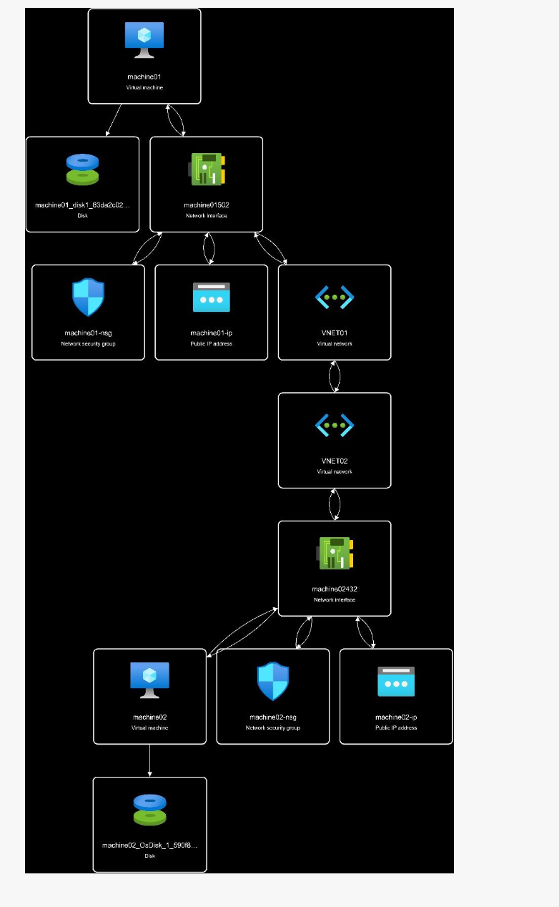

# Terraform Azure Lab Environment

Este projeto Terraform é usado para configurar um ambiente de laboratório no Azure com o mínimo de recursos para fins de teste e desenvolvimento. O ambiente consiste em dois grupos de recursos com máquinas virtuais em duas regiões diferentes, redes virtuais e sub-redes associadas, e um peering entre as duas redes virtuais.

## O que está sendo criado

- **Resource Group**: Um grupo de recursos chamado `LABORATORIOXP` é criado para conter todos os recursos.
- **Virtual Networks**: Duas redes virtuais (`VNET01` e `VNET02`) são criadas em regiões diferentes (Leste dos EUA e Sul do Brasil, respectivamente).
- **Subnets**: Uma subnet é criada em cada rede virtual.
- **Public IPs**: IPs públicos são alocados para cada máquina virtual.
- **Network Security Groups (NSGs)**: Grupos de segurança de rede são criados para definir regras de segurança para as VMs.
- **Network Interfaces (NICs)**: Interfaces de rede são criadas para permitir que as VMs se conectem à rede.
- **Virtual Machines**: Duas máquinas virtuais (`machine01` e `machine02`) são criadas nas redes virtuais correspondentes.
- **Managed Disks**: Discos gerenciados são criados e anexados às respectivas VMs.
- **VNET Peering**: Um peering é estabelecido entre `VNET01` e `VNET02` para permitir a comunicação entre as redes.

## Requisitos

Para usar este projeto, você deve ter o seguinte instalado:

- **Azure CLI**: Usado para autenticação com sua conta Azure. Pode ser instalado seguindo as instruções em [Instalar o Azure CLI](https://docs.microsoft.com/pt-br/cli/azure/install-azure-cli).
- **Terraform**: A infraestrutura como código é escrita para ser executada com o Terraform. Pode ser instalado seguindo as instruções em [Instalar o Terraform](https://www.terraform.io/downloads.html).

## Configuração do Ambiente

1. Instale o Azure CLI e o Terraform, se ainda não estiverem instalados.
2. Faça login no Azure com `az login`.
3. Clone este repositório para sua máquina local.
4. Navegue até o diretório clonado e inicialize o Terraform com `terraform init`.
5. Crie um plano de execução do Terraform com `terraform plan`.
6. Aplique a infraestrutura com `terraform apply`.

## Segurança

Assegure-se de nunca expor suas credenciais de administração ou chaves de acesso publicamente. Use variáveis de ambiente ou um cofre de chaves para gerenciar segredos e credenciais.

## Suporte

Para suporte, abra uma issue no repositório do GitHub onde este código está hospedado ou consulte a documentação oficial do Terraform e do Azure para orientação.

## Contribuições

Contribuições são bem-vindas! Para contribuir, por favor, faça um fork do repositório, faça suas alterações e abra um pull request.
